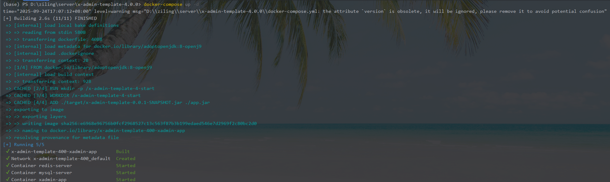
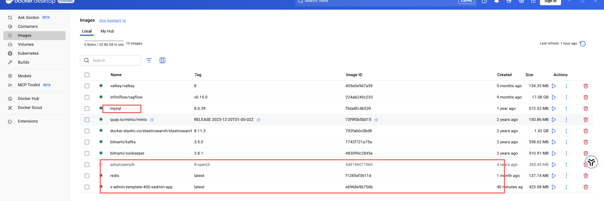
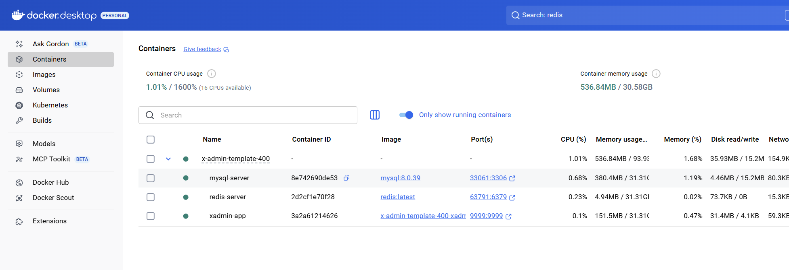
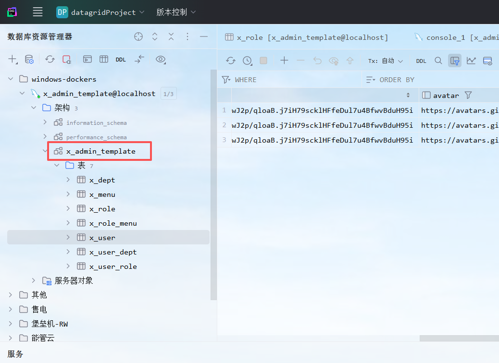
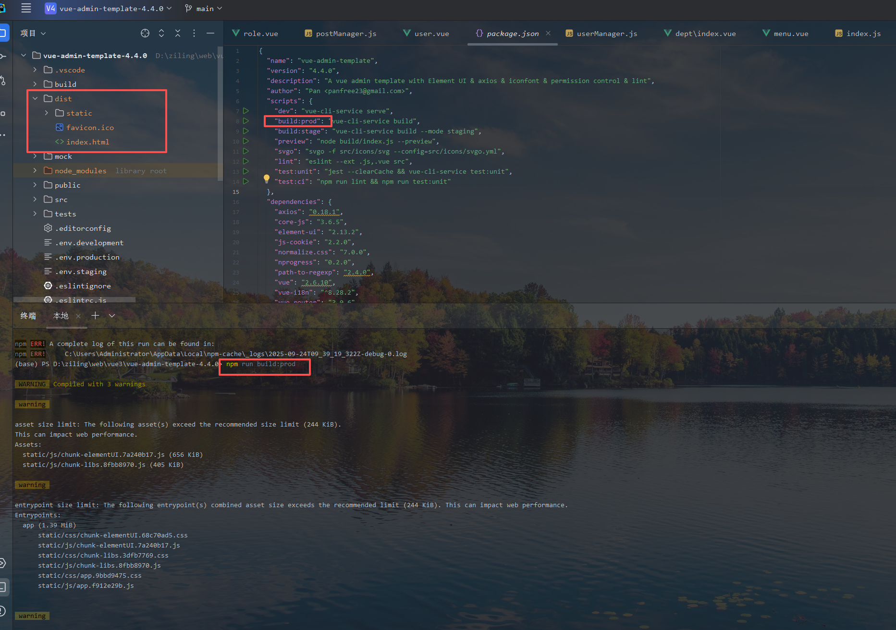

## 项目介绍
### 项目名称：x-admin-template
### 项目描述：基于vue3+element-plus的后台管理系统模板
### 项目作者：ziling
### 项目时间：2025-08-01
### 项目版本：1.0.0
### 项目状态：已完成

## 技术框架
### 前端：Vue3 + Element Plus+ vue-element-admin
### 后端：Spring Boot + Mybatis Plus + MySQL + Redis + JWT + Spring Security
### 关键技术实现：
- 跨域问题：通过配置CORS解决跨域问题
- 登录拦截：基于JWT的登录认证（带token和token过期）
- JWT有效期动态延长+刷新token机制(前端动态刷新本地cookie的token)
- 动态路由：根据用户角色动态生成路由
- 
### 接口工具：swagger-ui 入口：http://localhost:9999/swagger-ui/index.html

### 默认账号：alice｜加密前密码：password123｜数据库密码：$2a$10$8NkNLWv82CNwJ2p/qloaB.j7iH79scklHFfeDul7u4BfwvBduH95i

## docker 部署   
### 后端
- docker build -t xadmin-app:latest .
- docker-compose up -d

- 使用：init-docker.sql脚本

### 前端
- 项目根目录下执行：npm install
- 项目根目录下执行：npm run build:prod

